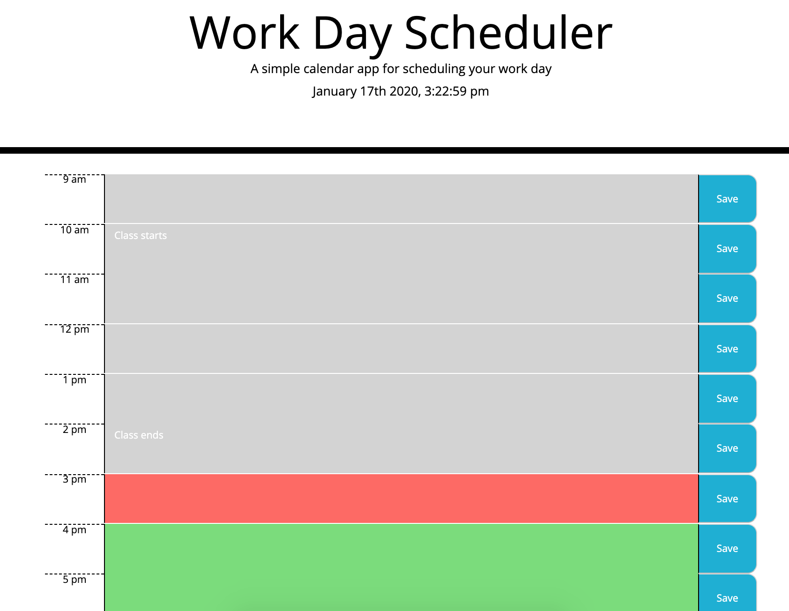

# Daily Planner Homework (Hwk_5)

**Description**

This is a calendar application that allows the user to save events for each hour of the day for a standard business day, 9am to 5pm. 

Each of the time slots represents one hour and contains the following:

-Time

-A field to hold user input

-Save button

When the user provides input into a given time slot and clicks the save button, the user input and the corresponding time will be stored in localStorage. 

Lastly, this application uses the Moment.js library to display at the top of the calendar, the current day and time. In addition, the library allows each hour will be color coded to reflect whether the time slot is in the past, the present, or the future.
